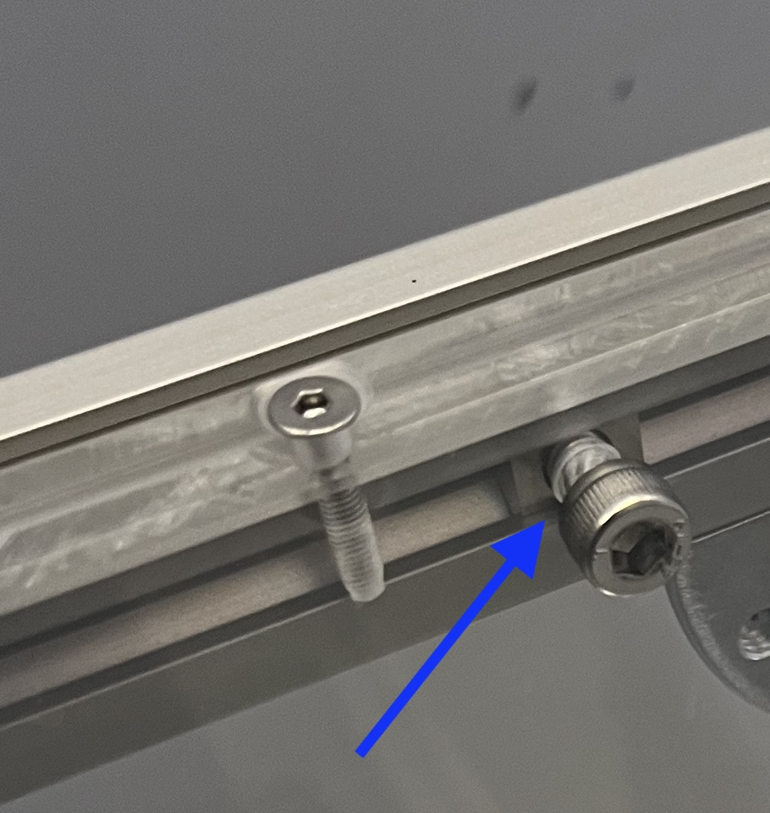

# Airtable part 4: Construction of the framework

{{BOM}}

Now you're going to fix the [air table center box](fromstep){Qty:1} with a surrounding framework, so it stands. We will later use 1/2" Thorlabs rods with angles to have an adjustable height. 

## Mount aluminium strut profiles {pagestep}

We will first add one aluminium strut profile to each long side of the air table.
 

- Place four [nuts](connectors.yml#5mmNuts){Qty:8} inside each [aluminium strut profiles (length: 480mm)](fromstep){Qty:2}. 
    - All four [nuts](connectors.yml#5mmNuts) need to be in one side of the strut.

- Now line the 4 nuts up with the holes inside the long side plates of the air table box (480mm). 

- Connect the air table box and the U-formation framework with four [M5 screw (12mm)](screws.yml#m5x12mm_screw){Qty:8} from the inside of the air box in each nut. 

