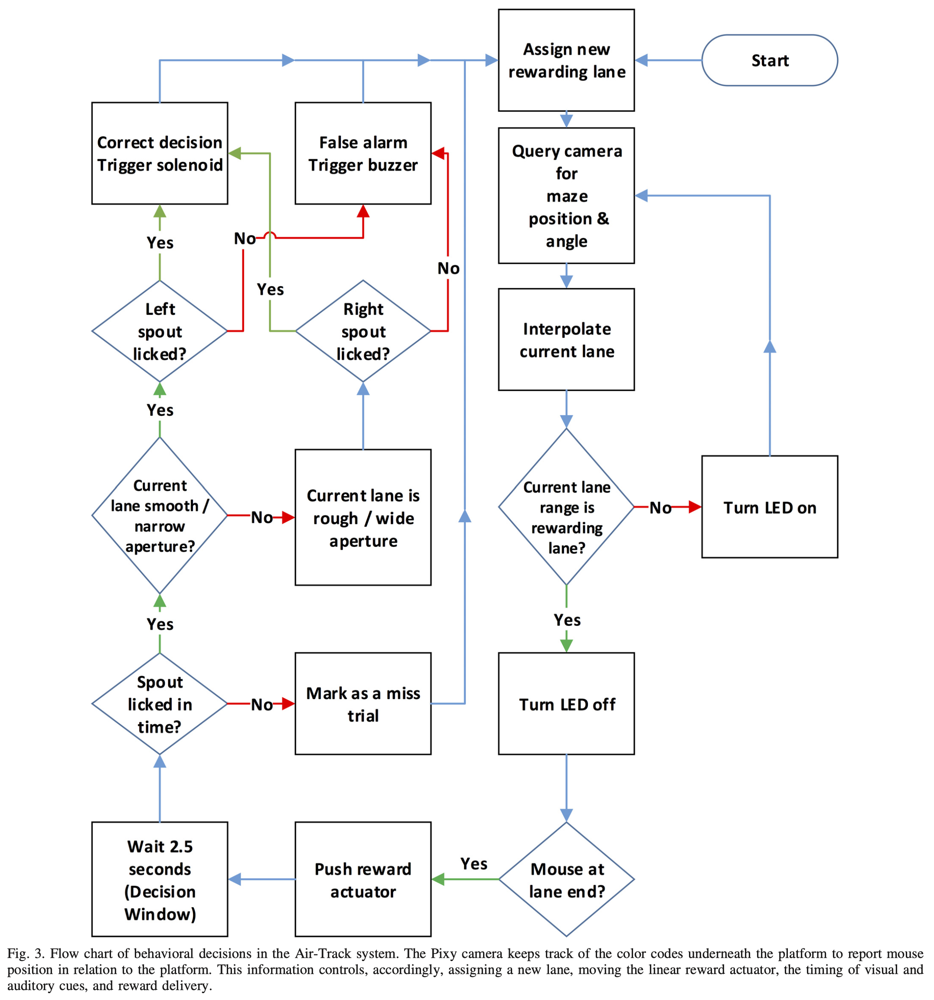

# Electronics part 4: Arduino code guide

The provided code handles a complex workflow. It tracks the position of the mouse and provides positional feedback and rewards. This process requires several external components which are set up at the start of the script. If errors arise, it's most likely within this section. 

For debugging you need to implement several print messages and check which get outputted and which not.

- There are currently the main important prints to check the functionality implemented. You can enable them by setting the variable test_run to "true". This variable is located at the top of the ".ino" file. 
    - If all messages get printed, the set up should work as intended. 
    - Additionally, you can test it by moving the platform until the prints state to be in the reward lane. These prints are always enabled. 

- You might need some extra debugging if unexpected errors occur.
    -  Code example for additional printing: Serial.print("Start sensor setup  ");

### Test run  {pagestep}

You can test the functionality by moving the platform until the prints state to be in the reward lane. These prints are always enabled. 

- Imagine to be a head fixed mouse while moving the platform. 

- Depending on the choice of the lick spot a reward should be provided or not. 

- Below you can view the hole workflow as displayed in the paper   [Air-Track: a real-world floating environment for active sensing in head-fixed mice](https://doi.org/10.1152/jn.00088.2016) in figure 3.

### Adjust pixel values in code {pagestep}

x value, if x along platform long side

### Linear actuator {pagestep}

- The airtrack code Github repository contains a linear actuator moving file which also can be used to test it

- The default mode of the code is to pull

