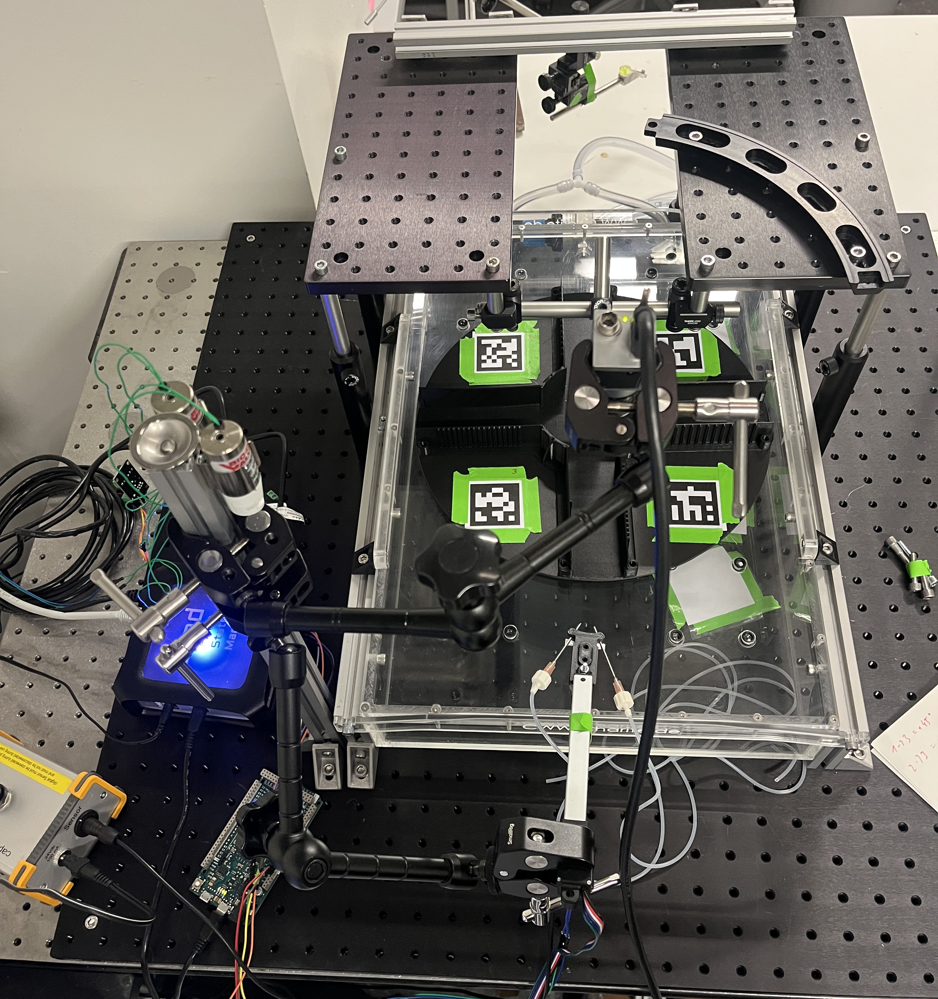
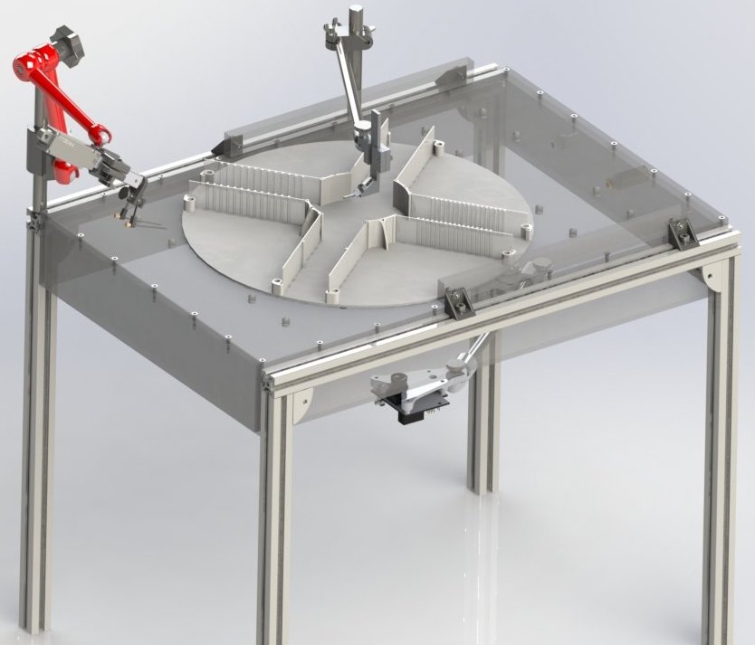

# Construct your Airtrack setup !

>! **Caution** 
>!
>! Website under construction

This website will guide you through the whole process of building a new Airtrack setup developed in 2025 in the Larkum Lab.
The previous Airtrack was first published in 2016, with a paper titled [Air-Track: a real-world floating environment for active sensing in head-fixed mice](https://doi.org/10.1152/jn.00088.2016)
The new version includes more error prone components and offers a wider flexibility in usage.
The central computing unit is now a PC and Bpod r2+ instead of an Arduino Uno.

It was developed by Fabio Reeh with the help of the Charité workshop (Alexander Schill).
This documentation website was created by Fabio Reeh and reviewed by Julien Colomb.

>!! **Warning** 
>!!
>!! New Images

This guide is part of the output from the [open.make project](https://www.openmake.de/) (see website for more information, including funding information). This project aims to further establish open hardware in academic research, and support
 scientist in the creation of FAIR research hardware.

## Table of contents

#### [General construction information in advance](general_construction_info.md){step}

#### [Construction of the airtable](airtable.md){step}

#### [Precut of aluminium profile strut](precut.md){step}

#### [Predrill of plexiglass](predrill.md){step}

#### [Glue and screw](glue.md){step}

#### [Construction of the basic framework](basicframework.md){step}

#### [Insertion of ball valves](ballvalve.md){step}

#### [Air flow and pressure control](air_flow.md){step}

#### [Mounting of the air table legs](airtable_legs.md){step}

#### [Construction of the peripherals](peripherals.md){step}

#### [Construction of an additional framework](add_framework.md){step}

#### [Construction of platform tracking](headandcamera.md){step}

#### [Construction of linear actuator front](actuator_head.md){step}

#### [Construction of the rewarding system](rewardsystem.md){step}

#### [Construction of the head fixation](headfixation.md){step}

#### [Floating platform](3Dprinting.md){step}

#### [Setup of the electronics](setup_electronic.md){step}

#### [Setup of the wiring](electronic.md){step}

#### [Installation of scripts](script_setup.md){step}

#### [Configuration of PixyCam](PixyCamConfig.md){step}

#### [Arduino code guide](code_usage.md){step}

#### [List of all necessary components]{BOM}

## About the Airtrack

To investigate the neuronal activities in ordinary behaviour, it's eligible to implement modern brain recording equipment.
These modern technics frequently require head fixation.
The Airtrack is one approach to facilitate analyzing natural behaviour in its complexity.
Behaviour is depended on permanent sensory feedback from various modalities and to provide the possibility of sensory perception in its totality is a central challenge.
The Airtrack aims to facilitate these multiple sensory and motor modality approaches in combination with a simple setup and less computational processing.
The shift from a virtual visual (air ball/ treadmill with VR) to somatosensory modality approach causes a natural tactile representation while having less computational needs besides no errors between perception and movement of the mice and corresponding virtual environment.
The virtual environment approaches faces the difficulties of estimating the perceptual experience of the mice or other animals and it's probably impossible to match virtual reality and real world experience. 
The developers conclude that the Airtrack system is ideal for eliciting natural behaviour in concert with virtually any system for monitoring or manipulating brain activity.

The Airtrack was used to perform Go/No-Go and two-alternative forced choice tasks with mice.

As the system is in use within Larkum Lab and gets developed, we encourage you to check the recent publications to see new variants and applications.

The previous Airtrack was first published in 2016, with a paper titled [Air-Track: a real-world floating environment for active sensing in head-fixed mice](https://doi.org/10.1152/jn.00088.2016).

References: [Nashaat MA, Oraby H, Sachdev RN, Winter Y, Larkum ME. Air-Track: a real-world floating environment for active sensing in head-fixed mice. J Neurophysiol. 116(4):1542-1553, 2016](https://pubmed.ncbi.nlm.nih.gov/27486102/)

#### Latest change: 24.10.2024